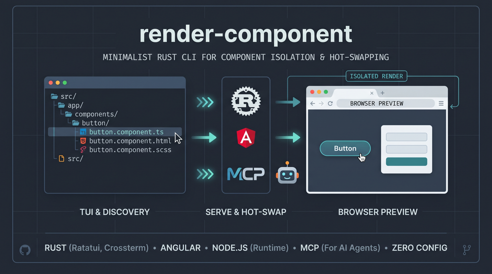

# render-component



Render a single UI component in the browser from a navigable file explorer — zero config, no `.stories`, no full-app builds. Keyboard-first TUI for humans, first-class MCP surface for AI agents.

**Status: v1 (Angular-only rendering).** React/Svelte/Vue files are detected and highlighted, but not renderable yet.

---

## Features

- **TUI file explorer** (ratatui) with keyboard + mouse navigation, in-place expand/collapse and a Telescope-style fuzzy finder.
- **Component highlighting**: Angular (`.component.ts`, `.module.ts`), React (`.tsx`), Svelte (`.svelte`) and Vue (`.vue`) files are visually marked; unsupported frameworks show a clear "not supported yet" message.
- **Render only the selected component** on a free port, including its template, SCSS and imports.
- **Hot-swap without restart**: if the dev server is already running, selecting another component replaces the view via selection IPC.
- **Headless `serve` entrypoint** for scripting and E2E.
- **MCP server**: AI agents can list, inspect, serve, open and hot-swap components using the same pipeline as the TUI.

## Requirements

- Rust toolchain ≥ 1.85 (`edition = "2024"`)
- **Node.js** — required at runtime by the render pipeline (pre-built Angular host + Angular builder/esbuild). The binary itself is pure Rust.

## Build

```sh
cargo build --release
```

Tests (no external harness needed):

```sh
cargo test
```

## Usage

### TUI explorer

```sh
render-component [path]          # default: current directory
```

| Key | Action |
| --- | --- |
| `↓` / `j`, `↑` / `k` | Move selection |
| `Enter` | Expand/collapse a folder · select a component file |
| `→` | Expand folder |
| `←` | Collapse folder / jump to parent |
| `/` | Fuzzy finder (Telescope-style) over the whole tree |
| `PageUp` / `PageDown`, `Home` / `End` | Scroll the log panel |
| `l` / `L` | Dump logs to `$TMPDIR/render-component-logs.log` |
| `q` | Quit |

Mouse: click a row to jump and activate it.

Selecting a renderable Angular component opens a dev server on a free port and renders **only that component**. Selecting another component while the server is up hot-swaps the view — no restart.

### Headless serve

```sh
render-component serve --component src/app/foo.component.ts [--root .] [--port PORT]
```

Options: `--component` (required), `--root`, `--port`, `--selection-file`, `--no-open`.

### MCP server

```sh
render-component mcp --path /path/to/project
```

Runs a Model Context Protocol server over stdio so AI agents can drive render-component:

| Tool | Description |
| --- | --- |
| `list_components` | List renderable components (optional `filter` substring) |
| `inspect_component` | Validate a component; returns class name, mount strategy, NgModule, required signal inputs |
| `select_component` | Render a component (starts server on first use, hot-swaps afterwards); returns preview URL |
| `get_status` | Session state: server running, URL/ports, current component |
| `get_logs` | Tail the shared log stream (`tail` default 100) |
| `stop_server` | Gracefully stop the dev server |
| `open_in_browser` | Open the preview URL in the default browser |
| `find_files` | Fuzzy file search (smart-case subsequence scoring) |
| `read_file` | Read a text file inside the project root (256 KiB cap; escapes rejected) |

## How it works

```
detect (classify) → validate (pipeline) → pre-built Angular host + dev server on a free port
                                        → selection IPC → hot-swap on next selection
```

1. **Detect** (`src/detect.rs`): classifies source files by framework/role (Angular standalone vs module, React/Svelte/Vue, other).
2. **Validate** (`src/pipeline.rs`): early feedback for broken or missing components before any tooling spins up.
3. **Serve** (`src/serve/`): starts the Angular host on a free port with only the selected component injected (template, SCSS, imports).
4. **Hot-swap**: later selections write a selection file + bump a revision — the running server replaces the view without restarting.
5. **Two surfaces, one pipeline**: the TUI and the MCP server call the same domain code (`detect`, `pipeline`, `serve`).

## Project layout

```
src/
  cli.rs            # clap CLI (TUI default, serve, mcp)
  detect.rs         # framework/role classification
  explorer/         # TUI tree navigation (nav) + fuzzy finder
  pipeline.rs       # component validation
  serve/            # dev-server lifecycle, selection IPC, shared logs
  host/             # browser opening
  logs.rs           # shared log stream
  mcp/              # MCP server over stdio + tool registry
features/           # MVP brief/plan/cases (feature-driven spec)
tests/fixtures/     # sample Angular project for tests
assets/             # images for the README (banner.jpg)
```

## Roadmap

- **v1 (now)**: Angular-only rendering, TUI + headless serve + MCP.
- **Next**: stabilize hot-swap for larger projects, harden MCP, documentation.
- **Later**: React/Svelte/Vue rendering reusing the detection + serve architecture.

See `PRODUCT.md` for the product vision (users, differentiation, scope, risks).